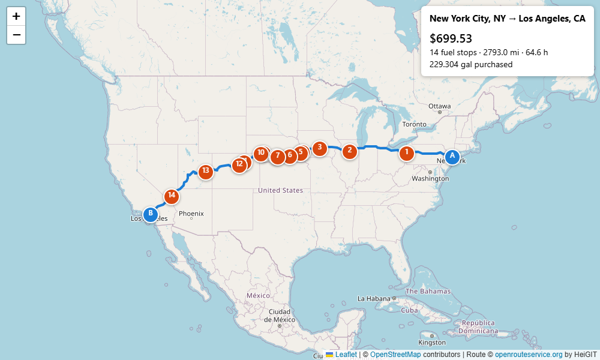
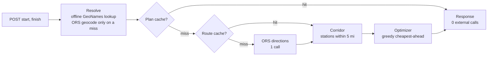

# Fuel Route Optimizer

A Django REST API that takes a start and finish in the USA and returns the driving route, the
cheapest fuel stops along it (50 gal tank, 10 mpg) and the total fuel cost. A new route costs
**one** routing API call (OpenRouteService); repeating it costs **zero**.



*`GET /api/route/map/` for New York, NY → Los Angeles, CA: 2,793.0 mi, 14 stops, $699.53.*

## Quick start

Requires **Python 3.12+** (Django 6.1). Tested on Python 3.14.4, Windows 11.

| step | Windows (PowerShell) | macOS / Linux |
|---|---|---|
| create venv | `py -m venv venv` | `python3 -m venv venv` |
| activate | `.\venv\Scripts\Activate.ps1` | `source venv/bin/activate` |
| create `.env` | `copy .env.example .env` | `cp .env.example .env` |

If PowerShell blocks `Activate.ps1`, run `Set-ExecutionPolicy -Scope Process Bypass` first.

Then set `ORS_API_KEY` in `.env` to a free key from [HeiGIT](https://account.heigit.org)
(openrouteservice's host; the free Standard plan is enough). `DJANGO_SECRET_KEY` can stay empty
while `DJANGO_DEBUG=true`. With the venv active, on either OS:

```bash
pip install -r requirements.txt
python manage.py migrate
python manage.py load_places      # 183,965 US places from data/us_places.csv, ~8 s, offline
python manage.py load_stations    # 8,151 rows -> 6,626 stations, 6,608 geocoded, ~2 s, offline
python manage.py runserver        # http://127.0.0.1:8000
```

Try it:

```bash
# macOS / Linux (on Windows use curl.exe)
curl -X POST http://127.0.0.1:8000/api/route/ -H "Content-Type: application/json" \
     -d '{"start": "New York, NY", "finish": "Los Angeles, CA"}'
```

```powershell
# Windows PowerShell
$r = Invoke-RestMethod -Method Post -Uri http://127.0.0.1:8000/api/route/ `
     -ContentType "application/json" -Body '{"start": "New York, NY", "finish": "Los Angeles, CA"}'
$r.summary; $r.map_url
```

Open the returned `map_url` in a browser for the map. Run the tests (ORS is mocked; no key needed):

```bash
python manage.py test routing     # 125 tests
```

A [Postman collection](docs/SpotterFuelRoute.postman_collection.json) runs 10 demo requests with
assertions (`base_url` = `http://127.0.0.1:8000`).

## API

### `POST /api/route/`

| field | type | default | notes |
|---|---|---|---|
| `start` | string | required | `"City, ST"`, `"City, State Name"` or `"lat,lng"` (US only) |
| `finish` | string | required | same formats |
| `start_fuel_gallons` | number | `50` | 0–50; rounded to 3 dp; the starting fuel is not charged |

Real response for New York, NY → Los Angeles, CA (first 2 of 14 stops, geometry trimmed):

```json
{
  "summary": {
    "total_fuel_cost": "699.53",
    "total_gallons_purchased": "229.304",
    "fuel_used_gallons": "279.304",
    "fuel_remaining_at_finish": "0.000",
    "stop_count": 14,
    "distance_miles": 2793.0,
    "duration_hours": 64.6,
    "stations_in_corridor": 365
  },
  "fuel_stops": [
    {"stop": 1, "station_id": 72445, "name": "SHEETZ #639", "address": "I-80 Exit 223",
     "city": "Youngstown", "state": "OH", "lat": 41.09978, "lng": -80.64952,
     "mile_marker": 393.4, "offset_miles": 3.7,
     "price_per_gallon": "3.059", "gallons": "35.486", "cost": "108.55"},
    {"stop": 2, "station_id": 70744, "name": "CASEYS #3686", "address": "I-80 EXIT 81",
     "city": "Utica", "state": "IL", "lat": 41.34059, "lng": -89.01008,
     "mile_marker": 854.9, "offset_miles": 1.9,
     "price_per_gallon": "2.969", "gallons": "24.396", "cost": "72.43"}
  ],
  "start": {"query": "New York, NY", "label": "New York City, NY", "lat": 40.71427, "lng": -74.00597, "source": "place"},
  "finish": {"query": "Los Angeles, CA", "label": "Los Angeles, CA", "lat": 34.05223, "lng": -118.24368, "source": "place"},
  "assumptions": {
    "tank_gallons": "50.000", "mpg": 10, "start_fuel_gallons": "50.000", "start_fuel_charged": false,
    "corridor_miles": 5.0, "profile": "driving-hgv", "station_location_precision": "city centroid"
  },
  "external_api_calls": 1,
  "cached": false,
  "timings_ms": {"resolve": 3.3, "route": 1349.0, "corridor": 52.8, "optimize": 0.8, "total": 1408.4},
  "map_url": "http://127.0.0.1:8000/api/route/map/?start=New+York%2C+NY&finish=Los+Angeles%2C+CA&start_fuel_gallons=50.000",
  "warnings": ["There may be restrictions on some roads"],
  "route": {"type": "Feature", "properties": {}, "geometry": {"type": "LineString", "coordinates": ["…18,319 [lon, lat] points…"]}}
}
```

| field | meaning |
|---|---|
| `summary` | totals: cost (sum of stop costs), gallons bought/used/left, stop count, miles, hours, stations considered |
| `fuel_stops` | stops in route order: station, location, `mile_marker`, `offset_miles` from the route, price, gallons, cost |
| `start`, `finish` | how each input was resolved (`source`: `place`, `coordinates` or `ors_geocode`) |
| `assumptions` | tank, mpg, start fuel, corridor width, routing profile, station position precision |
| `external_api_calls` | real HTTP calls this request made (0 when cached) |
| `cached` | `true` when the whole plan came from the plan cache |
| `timings_ms` | per-stage timings (resolve, route, corridor, optimize, total) |
| `map_url` | the same plan as an HTML map |
| `warnings` | ORS routing warnings, passed through |
| `route` | GeoJSON Feature with the route LineString (last, because it's large) |

Decimal values (money, gallons, prices) are JSON strings. `price_per_gallon` has the full stored
precision (up to 8 dp), so `gallons × price_per_gallon` rounds to `cost` exactly.

### `GET /api/route/map/?start=&finish=&start_fuel_gallons=`

The same plan (same caches) as a Leaflet page: route, numbered stops with price/gallons/cost
popups, and a summary box. Errors render an HTML page with the same status and message. GET only.

### `GET /api/health/`

`{"ok": true, "stations": 6626, "stations_geocoded": 6608, "places": 183965, "stations_version": "…"}`

### Errors

Every error is `{"error": {"code": "...", "message": "...", ...details}}`. The mapping lives in one
table in [`routing/errors.py`](routing/errors.py):

| status | code | when |
|---|---|---|
| 400 | `invalid_request` | body fails validation (missing field, `start_fuel_gallons` outside 0–50, not a number); `fields` lists messages |
| 400 | `parse_error` | body isn't valid JSON |
| 400 | `invalid_location` | wrong format, unknown US state, place not found, outside the US, start = finish |
| 400 | `unroutable_point` | no road near a point, e.g. in the sea (ORS error 2010); `point` = `start`/`finish` |
| 404 | `not_found` | unknown `/api/...` path |
| 405 | `method_not_allowed` | wrong HTTP method on `/api/route/` (the map returns a bare 405) |
| 422 | `unreachable` | a gap between fuel stops is longer than the tank's range; `gap_miles`, `from_mile`, `to_mile` |
| 422 | `no_route` | no road route between the points, e.g. Honolulu → LA (ORS error 2009) |
| 500 | `internal_error` | unexpected error (logged with traceback; no details in the body) |
| 502 | `upstream_error` | ORS failed, timed out or returned a malformed response |
| 503 | `upstream_quota` | ORS quota exceeded (ORS 403/429) |

## How it works



**Data prep (offline, once).**
- The price file has 8,151 rows. The 620 Canadian rows are excluded.
- Deduplicating by OPIS ID, keeping the lowest listed price, leaves 6,626 unique US stations.
- 6,608 of them (99.7%) are geocoded offline by (city, state) against GeoNames US populated places.
- Each station's position is its city's centroid, since the file only has highway-exit addresses.

**Corridor.**
- Resample the route to 0.5 mi points and project them and the stations to unit-sphere xyz.
- A `scipy` `cKDTree` finds each station's nearest route point, which gives its `mile_marker` and `offset_miles`.
- Stations within 5 mi are kept. For NY → LA that's 365 candidates.

**Optimizer** ([`routing/services/optimizer.py`](routing/services/optimizer.py)).
- From each stop, if a cheaper station is within the 500 mi range, buy just enough to reach the nearest one.
- If none is cheaper, fill the tank and go to the cheapest station in range (on a tie, the farther one).
- A gap longer than the range → `unreachable`.

The finish is treated as a $0 station, so "buy just enough to reach something cheaper" also ends
the trip with an empty tank. It's optimal because any gallon burned before a cheaper station is
cheapest bought at the cheapest station already passed, and when nothing ahead in range is
cheaper, every gallon you can carry is cheapest right here. The tests compare it against a brute-force
optimum on 200 random cases.

**Caching** (Django cache):

| layer | key | TTL |
|---|---|---|
| geocode fallback | `geo:v1:{sha1(normalized query)}` | 30 days (not found: 1 day) |
| route | `route:v1:{sha1(profile + coordinates at 4 dp)}` | 7 days |
| plan | `plan:v1:{route}:{stations_version}:{tank}:{mpg}:{start_fuel}:{corridor}` | 1 day |

`stations_version` (row count + import time) changes on every `load_stations`, which invalidates
plans (not routes) and rebuilds the in-memory station index.

More detail: [docs/DESIGN.md](docs/DESIGN.md).

## External API calls

| request | calls |
|---|---|
| new route, both places resolved offline | 1 |
| same request again | 0 |
| map after the POST | 0 |
| each start/finish that needs online geocoding | +1 (first time only; cached) |
| maximum | 3 |

## Performance

Measured on NY → LA on the dev machine (`timings_ms`):

| case | time |
|---|---|
| cold (fresh server process) | ~1.5 s total, of which ~1.4 s is the ORS call (network-dependent; one fresh-clone run took 3.6 s) |
| warm (plan cache) | ~19 ms |
| route cached, new `start_fuel_gallons` | ~26 ms |
| corridor stage | ~8–50 ms (the higher figure includes building the station index on first use) |
| optimizer | ~1 ms |

## Assumptions

- Tank 50 gal, 10 mpg (500 mi range). The truck starts full by default, and that starting fuel is not charged.
- Duplicate OPIS IDs with different prices → the lowest listed price is kept, along with that row's name.
- Stations are located at their city's centroid. The corridor is 5 mi. Routing uses the ORS `driving-hgv` profile.
- The optimizer minimizes total fuel cost only. It doesn't model time or overhead per stop, so it may make
  small top-ups when a slightly cheaper station is ahead. A per-stop cost would need DP over
  (station, fuel level).
- The detour from the route to a station inside the corridor is ignored.

## Known limitations

- Coordinate input is checked against coarse US bounding boxes (lower 48, Alaska, Hawaii), so points just
  across the northern border (e.g. Ottawa, 45.42,-75.70) pass the check. `"City, ST"` input is US-only.
- Routes through Canada (e.g. Anchorage → Seattle) usually return 422 `unreachable`, because
  Canadian stations are excluded.
- There is no per-stop cost (see Assumptions), so plans can have many small stops (NY → LA: 14).
- Prices update only via `load_stations`. Editing Station rows directly leaves cached plans stale.
- Gallons reconcile to within 0.0005 gal per stop because each purchase is rounded to 3 dp.
- 18 stations (0.3%) whose town isn't in GeoNames are excluded. `"New York, NY"` maps to GeoNames'
  "New York City" through one explicit alias (`ALIASES` in `routing/services/places.py`).
- ORS moved from `api.openrouteservice.org` to `api.heigit.org`
  ([announcement](https://ask.openrouteservice.org/t/deprecating-api-openrouteservice-org-in-favour-of-api-heigit-org/7912)).
  Directions are under `/openrouteservice/v2/...` and geocoding under `/pelias/v1/...`.

## Production notes

- Caches are LocMem, which is per process. Use a shared cache (e.g. Django's `RedisCache`) with several workers.
- Each worker builds its own in-memory station index (6,608 stations) on its first request.
- `check --deploy` with `DJANGO_DEBUG=false` leaves 4 HTTPS warnings (HSTS, SSL redirect, secure
  session and CSRF cookies), which are expected for a local assessment. `DJANGO_SECRET_KEY` is required
  when DEBUG is off.
- ORS free-plan limits are 2,000 directions requests per day and 40 per minute
  ([FAQ](https://giscience.github.io/openrouteservice/frequently-asked-questions.html)). Quota errors return 503.

## Project structure

```
fuelroute/settings.py            settings from env (.env), LocMem cache, ORS and optimizer defaults
fuelroute/test_runner.py         quiet logs; blocks real ORS HTTP during tests
routing/models.py                Place (GeoNames), Station (fuel prices), stations_version()
routing/serializers.py           request validation; start fuel -> 3-dp Decimal
routing/errors.py                exception -> (status, code) table; JSON error shape
routing/views.py                 route, map, health endpoints; JSON 404 for /api/...
routing/services/places.py       name normalization, offline matcher, start/finish resolver
routing/services/ors.py          ORS client (directions, geocode): the only request-time HTTP
routing/services/corridor.py     in-memory station index; route resampling + KD-tree corridor
routing/services/optimizer.py    greedy fuel plan (pure Python)
routing/services/planner.py      plan_route(): pipeline, caches, timings
routing/management/commands/     load_places, load_stations (offline data import)
routing/templates/routing/       map.html (Leaflet), map_error.html
routing/tests/                   125 tests; fixtures incl. a real NY -> LA route and ORS error bodies
data/fuel-prices.csv             provided price file (converted from xlsx, prices exact)
data/us_places.csv               trimmed GeoNames US populated places
docs/                            DESIGN.md, map.png, Postman collection
```

## Attribution

- `data/us_places.csv` is derived from [GeoNames](https://www.geonames.org/) (CC BY 4.0).
- Map data © [OpenStreetMap](https://www.openstreetmap.org/copyright) contributors.
- Routing and geocoding by [openrouteservice](https://openrouteservice.org/) / HeiGIT.
